# 프로젝트 DG 기획서

## 프로젝트 개요

### 프로젝트 컨셉

본 프로젝트는 GAS(Gameplay Ability System) 기반으로 설계된 액션 RPG이다.

플레이어는 Solo play, Co-op play를 통해 오픈월드를 탐험하며 얻은 장비를 바탕으로 지역 지배보스를 처치하는걸 목표로 한다.

### 🎮 장르 정의

- 3인칭 오픈월드 ARPG

### 🔥 한 줄 요약

강력한 장비로 지역 지배보스를 처치. 보상으로 다시 장비 강화

---

## 구현할 게임 구조(Gameplay Core)

### 🔁 기본 구조

로비→ 새 세션 → 오픈월드 진입 → 월드 탐험 → 보스전투 → 새로운 제작재료 획득 → 다음 지역 진입 → 월드에서 나가기

### 🔁 Co-op 구조

로비/월드내 에서 친구의 파티참가 요청을 받을 수 있음. 수락 시 파티가 결성되며 파티장의 월드로 자동 이동,스폰. 월드의 상태는 파티장 상태로 동기화 

### 🎯 구현 예정항목

- 맵/레벨
    
    레벨은 World Paritition 을 통해 라이브 스트리밍 맵 로딩을 지원한다.
    
    Grid Cell 분할 / HLOD 사용.
    
    예시 이미지
    
    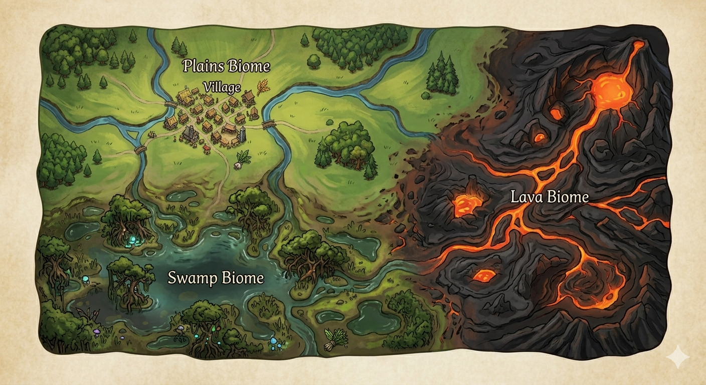
    
    ### 마을
    
    시작 및 기본마을.
    
    #### 추천 에셋
    
    [https://www.fab.com/ko/listings/9a10f51b-8844-45c9-89c5-7d4d43d75761](https://www.fab.com/ko/listings/9a10f51b-8844-45c9-89c5-7d4d43d75761)
    
    ### 초원
    
    마을에서 부터 자연스럽게 이어지는 잔디 기반 맵.
    
    #### 추천 에셋
    
    https://fab.com/s/45fba8461e3c
    
    ### 늪지
    
    #### 추천 에셋
    
    https://www.fab.com/ko/listings/41b04af3-274d-4921-97e3-52aa7a6b45d5
    
    https://www.fab.com/ko/listings/a2ab9a3c-4862-421a-8f58-47463695c6ba 
    
    늪지와 초원사이 점점 습해지는 지형에 배치하기 좋은 에셋
    
    ### 용암
    
    #### 추천 에셋
    
    가지고 있는 용암
    
    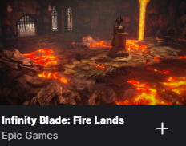
    
    https://www.fab.com/ko/listings/6cb3c83a-f578-4397-a367-b67245de55d6
    
    구매해야 됨
    
    ### 습지
    
    #### 추천 에셋
    
    https://www.fab.com/ko/listings/460311fc-fd70-4660-ac6f-1d5aac245f5c
    
- 플레이어블 캐릭터
    
    #### 전사
    
    #### 외형
    
    현재 사용할 에셋 미정. (검성/수호성 중 언팩되면 그거 사용) 
    
    언팩 안될시 사용 에셋 
    
    https://www.fab.com/ko/listings/122fd7bf-6f12-4304-a930-cccbbacdaebc
    
    https://www.fab.com/ko/listings/d237534b-9ba7-4c48-8cd9-8a1fd1965119
    
    #### 스킬
    
    - 예리한 일격 (3타 콤보형)
        
        논타겟형/ 이동가능/ 일반 공격 스킬 / 전방 4M
        
        재시전 시간 1초 / 즉시 시전 / 정신력 100 회복
        
        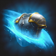
        
        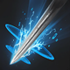
        
        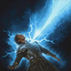
        
    - 절단의 맹타 (2타 콤보형)
        
        논타겟형 / 이동가능/ 자원 소모 스킬 (정신력 120 소모) / 전방 4M
        
        재시전 시간 0.5초 / 즉시 시전
        
        
        
        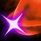
        
    - 내려찍기
        
        타겟형 / 시전 시 공중 이동 / 8M 
        
        재시전 시간 5초 / 즉시 시전
        
        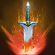
        
    - 발목 베기
        
        타겟형 / 시전 시 대상 3초 이동속도 감소 / 4M
        
        재시전 시간 10초 / 즉시 시전 / 그로기 피해량 10
        
        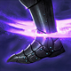
        
    - 분쇄 파동
        
        논타겟형 / 자기 중심 피해 / 정신력 소모 250 / 주위 4M
        
        재시전 시간 20초 / 즉시 시전 / 그로기 피해량 5
        
        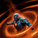
        
    - 파멸의 맹타
        
        타겟형 / 대상에게 돌진 / 돌진 후 5초 동안 피해 증폭 15% / 정신력 250 소모 / 8M
        
        재시전 시간 30초 / 즉시 시전 / 그로기 피해량 15
        
        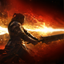
        
    
    #### 궁사
    
    #### 외형
    
    현재 사용할 에셋 미정. (궁성 언팩시 그거 사용) 
    
    언팩 안될시 사용 에셋 
    
    https://www.fab.com/ko/listings/7d76ddf0-d9ce-4d00-939e-d72793534d01
    
    #### 스킬
    
    - 저격 (3타 콤보형)
        
        타겟형/ 이동가능/ 일반 공격 스킬 / 20M
        
        재시전 시간 1초 / 즉시 시전 / 정신력 120 회복
        
        
        
        
        
        
        
    - 속사
        
        타겟형 / 이동가능/ 자원 소모 스킬 (정신력 96 소모) / 20M 
        
        재시전 시간 0.5초 / 즉시 시전 / 대상 주변 4M 피해
        
        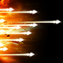
        
    - 송곳 화살
        
        타겟형 / 20M / 치명타 시 출혈 상태  / 그로기 피해 5
        
        재시전 시간 5초 / 즉시 시전
        
        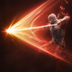
        
    - 광풍 화살
        
        타겟형 / 시전 시 10초동안 아군속도 8%만큼 증가 / 정신력 200소모 / 20M
        
        재시전 시간 20초 / 시전시간 1초 (힘들면 즉시시전으로) / 그로기 피해량 10
        
        
        
    - 조준 화살
        
        타겟형 / 정신력 소모 200 / 20M / 그로기 일 시 20% 추가데미지
        
        재시전 시간 20초 / 시전시간 1초 (힘들면 즉시시전으로) / 그로기 피해량 10
        
        
        
    - 표적 화살
        
        타겟형 / 이동기 / 데칼로 화살을 쏴 그리로 순간이동 / 정신력 50 소모 / 20M
        
        재시전 시간 10초 / 즉시 시전
        
        
        
    
    #### 마도사
    
    #### 외형
    
    현재 사용할 에셋 미정. (마도성 언팩시 그거 사용) 
    
    언팩 안될시 사용 에셋 
    
    https://www.fab.com/ko/listings/51935254-f70f-400a-8ca5-91a3e1b83e3b
    
    #### 스킬
    
    - 불꽃 화살 (3타 콤보형)
        
        타겟형/ 이동가능/ 일반 공격 스킬 / 20M
        
        재사용 즉시 시전 / 즉시 시전 / 정신력 100 회복
        
        
        
        
        
        
        
    - 얼음 사슬 (2타 콤보형)
        
        타겟형 / 이동가능/ 자원 소모 스킬 (정신력 120 소모) / 20M / 
        
        재시전 즉시 시전 / 즉시 시전 / 대상 주변 4M 피해 / 그로기 피해 2
        
        
        
        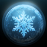
        
    - 불꽃 작살
        
        타겟형 / 20M / 치명타 시 화상 상태  / 그로기 피해 5
        
        재시전 시간 5초 / 즉시 시전 / 정신력 250 소모
        
        
        
    - 집중의 기원
        
        논타겟 / 시전 시 20초동안 아군 공격력 10% 상승 / 정신력 100소모 / 이동 가능
        
        재시전 시간 60초 / 즉시시전 
        
        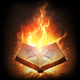
        
    - 지옥의 화염
        
        타겟형 / 정신력 소모 200 / 20M / 차지 스킬/ 4M 범위 데미지
        
        재시전 시간 45초 / 시전시간 0.5/1/1.5초  / 그로기 피해량 20/25/35
        
        
        
    - 혹한의 바람
        
        타겟형 / 20M / 정신력 150 / 대상위치에 2초동안 4M AOE / AOE 안에 있으면 둔화 
        
        재시전 시간 20초 / 즉시 시전 / 그로기 피해량 10
        
        
        
    
    #### 암살자
    
    #### 외형
    
    현재 사용할 에셋 미정. (살성 언팩시 그거 사용) 
    
    언팩 안될시 사용 에셋 
    
    https://www.fab.com/ko/listings/dc21702b-7f1e-4aa5-a747-78d519f5fb51
    
    https://www.fab.com/ko/listings/0bf014eb-f2ed-4029-adda-81a855eb5220
    
    #### 스킬
    
    - 빠른 베기 (3타 콤보형)
        
        논타겟/ 이동가능/ 일반 공격 스킬 / 전방 4M
        
        재사용 1초 / 즉시 시전 / 정신력 100 회복
        
        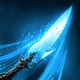
        
        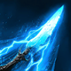
        
        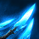
        
    - 기습
        
        논타겟형 / 이동가능/ 자원 소모 스킬 (정신력 100 소모) / 전방4M / 
        
        재시전 1초 / 즉시 시전 / 그로기 피해 7 / 대상 후방에서 공격시 50% 추가 데미지
        
        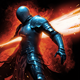
        
    - 암습
        
        타겟형 / 20M /  그로기 피해 10 / 정신력 150 소모
        
        재시전 시간 20초 / 즉시 시전 / 시전 위치에서 반대로 이동
        
        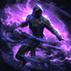
        
    - 섬광 베기
        
        타겟형 / 4M / 그로기 피해 7 / 시전위치에서 반대로 이동 
        
        재시전 시간 10초 / 즉시시전 
        
        
        
    - 심장 찌르기
        
        논타겟형 / 전방 4M / 치명타 시 방어도 -디버프
        
        재시전 시간 5초 / 즉시 시전  / 그로기 피해량 5
        
        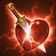
        
    - 침투
        
        전방시전형 / 10M / 사용 시 10M 이동하며 데미지 / 보스관통 가능 
        
        재시전 시간 20초 / 즉시 시전 / 그로기 피해량 10
        
        
        
- NPC 캐릭터
    
    #### 대장장이
    
    #### 외형
    
    사용 에셋
    
    https://www.fab.com/ko/listings/85698ecb-e60c-4882-a7e1-746345602c12
    
    #### 구현 항목
    
    - 장비 제작
        
        제작 재료로 장비 제작.
        
        장비는 총 3종류 (10/20/30) 렙 구현. 각 캐릭터 레벨 별로 제작 가능한 장비가 따로 보임.
        
    - 장비 재설정
        
        장비의 랜덤한 스탯을 랜덤한 걸로 재설정. 메모리얼 기능을 탑재해 전/후 중 한개를 선택해 부여.
        
    
    #### 상점
    
    #### 외형
    
    사용 에셋
    
    https://www.fab.com/ko/listings/e3b7b93c-2633-4f60-8cf1-8ee5bf7de4a9
    
    #### 구현 항목
    
    - 상점
        
        제작 재료를 팔아서 골드 확보
        
        골드로 재설정재료를 사거나, 포션을 살 수 있게 구현.
        
    
- 몬스터 캐릭터
    
    몬스터는 파티장 레벨 별로 스케일링. DT으로 관리
    
    #### 보스몬스터
    
    - 1번 보스
        
        #### 외형
        
        사용 에셋
        
        https://www.fab.com/ko/listings/85698ecb-e60c-4882-a7e1-746345602c12
        
        #### 구현 항목
        
        - 장비 제작
            
            제작 재료로 장비 제작.
            
            장비는 총 3종류 (10/20/30) 렙 구현. 각 캐릭터 레벨 별로 제작 가능한 장비가 따로 보임.
            
        - 장비 재설정
            
            장비의 랜덤한 스탯을 랜덤한 걸로 재설정. 메모리얼 기능을 탑재해 전/후 중 한개를 선택해 부여.
            
    - 2번 보스
        
        #### 외형
        
        사용 에셋
        
        https://www.fab.com/ko/listings/85698ecb-e60c-4882-a7e1-746345602c12
        
        #### 구현 항목
        
        - 장비 제작
            
            제작 재료로 장비 제작.
            
            장비는 총 3종류 (10/20/30) 렙 구현. 각 캐릭터 레벨 별로 제작 가능한 장비가 따로 보임.
            
        - 장비 재설정
            
            장비의 랜덤한 스탯을 랜덤한 걸로 재설정. 메모리얼 기능을 탑재해 전/후 중 한개를 선택해 부여.
            
    
    #### 필드몬스터
    
    - 늑대
        
        #### 외형
        
        사용 에셋
        
        https://www.fab.com/ko/listings/2dd7964c-a601-4264-a53d-465dcae1644c
        
        #### 구현 항목
        
        - 어그로/공격
            
            일정 범위내 들어오면 전투 진행.
            
            전투 중 물기정도 사용하고, 일정 범위 이상 도망 시 어그로 해제 되게
            
        
        #### 드랍 아이템
        
        - 10레벨 장비 제작용 재료
            
            이름은 모피 정도로 
            
    - 리자드맨
        
        #### 외형
        
        사용 에셋
        
        https://www.fab.com/ko/listings/19b4b76a-d473-4e0c-82b4-0ca67dcb56f5
        
        #### 구현 항목
        
        - 어그로/공격
            
            일정 범위내 들어오면 전투 진행.
            
            전투 중 물기정도 사용하고, 일정 범위 이상 도망 시 어그로 해제 되게
            
        
        #### 드랍 아이템
        
        - 20레벨 장비 제작용 재료
            
            이름은 비늘 정도로 
            
    - 골렘
        
        #### 외형
        
        사용 에셋
        
        https://www.fab.com/ko/listings/89b16c3a-47ea-486e-ac09-bc2237af93f9
        
        #### 구현 항목
        
        - 어그로/공격
            
            일정 범위내 들어오면 전투 진행.
            
            전투 중 물기정도 사용하고, 일정 범위 이상 도망 시 어그로 해제 되게
            
        
        #### 드랍 아이템
        
        - 30레벨 장비 제작용 재료
            
            이름은 주괴 정도로 
            
- UI
    
    #### 캐릭터 생성 창
    
    사전에 직업별 에셋을 제공하고 이름지정해 서버에 캐릭터 저장.
    
    유저는 아이디/비밀번호로 캐릭터를 불러옴
    
    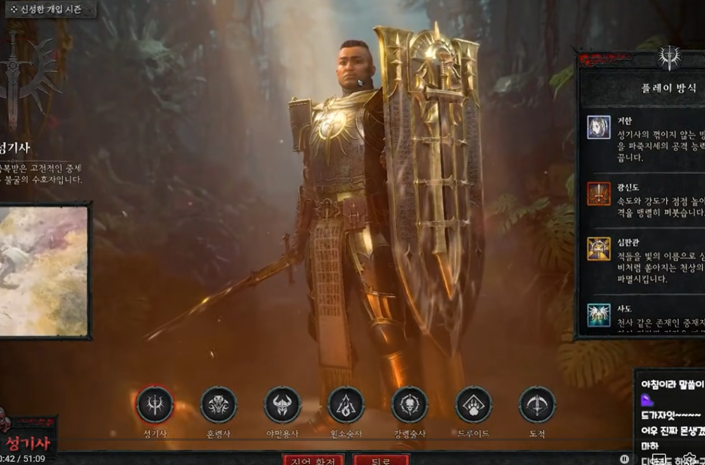
    
    #### 로비
    
    월드 입장 전 파티 구성 및 새 세션 찾기 가능한 UI. 
    
    각 세션에 입장시 방 번호/ 비밀번호 입력.
    
    각 플레이어는 방 번호 / 비밀번호로 세션에 입장 가능
    
    #### 인벤토리 / 캐릭터 정보창
    
    디아블로4 처럼 인벤토리 + 캐릭터정보창이 합쳐진 창
    
    인벤토리는 총 장비 30칸. 제작재료 30칸. 소모품 30칸으로 구성.
    
    
    
    90칸 + 골드 + 상세 능력치 
    
    #### HUD
    
    
    
    필수 구현항목 
    
    - 체력바
        
        
    - 정신력바
    - 아군 파티창
        
        
        
        
        
        
    - 적 상태창
        
        
        
        
        
    - 미니맵
    
    선택 구현항목
    
    - 채팅창
    - 퀘스트 창
        
        
    
    #### 지도
    
    .png)
    
    필수 구현항목 
    
    - 미니맵 (상단 사진 찍고 ai 로 이미지 변환할 것 )
        
        
    - wasd /마우스 미니맵 이동
    - 마우스 포인트 활성화
    - 휠 업다운 확대 축소
    
- 아이템
    
    #### 캐릭터 장비
    
    무기 포함 총 6부위. (방어구5 + 무기1) 
    
    1안. 레벨 별 장비 매시 3종. (구현 난이도 어려움)
    
    입엇을때 캐릭터 외형도 변경가능.
    
    2안. 아이콘/능력치만 변경. 매시는 그대로 (구현 난이도 낮음)
    
    일단 2안으로 상정하고. 아이콘 예시만 넣어둠. 
    
    해당 안으로 진행하게 돼 아이콘을 사용 시 64x64 까지 업스케일링 및 INVEN 로고 지우는 작업 필요.
    
    #### 영웅 (배경색 보라색 / #**271435**)
    
    
    
    .png)
    
    
    
    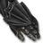
    
    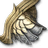
    
    
    
    
    
    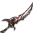
    
    
    
    #### 전설 (배경색 주황색/ #**882f02)**
    
    
    
    
    
    
    
    
    
    
    
    
    
    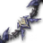
    
    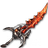
    
    
    
    #### 고대 (배경색 흰회색/ **#a28b5f)**
    
    
    
    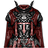
    
    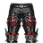
    
    
    
    
    
    
    
    
    
    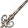
    
    
    
    #### 제작 재료
    
    월드 레벨에 따라 (파티장 레벨에 귀속 동기화) 드랍되는 재료 변경 
    
    보스 처치 시 3-4 개의 재료를 랜덤하게 드랍. 3개 50%, 4개 50% 확률.
    
    장비 제작 시 4개 소모.
    
    #### 1-10레벨
    
    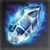
    
    #### 11-20레벨
    
    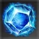
    
    #### 21-30레벨
    
    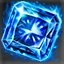
    
    #### 재설정 아이템
    
    보스 처치 시 20% 정도의 확률로 (일단은 해보고 결정) 드랍. 
    
    해당 아이템으로 대장장이에게 아이템 스탯 재설정 가능.
    
    
    
    #### 소모품
    
    힐링 물약정도만 구현.
    
    물약은 즉발형/지속회복 형 중 고민. 아이콘은 아래 이미지 사용.
    
    
    
- 서버
    
    네트워크 구조: Dedicated Server + Backend + DB
    
    #### 클라이언트
    
    - 로그인 UI
    - 캐릭터 생성 / 선택 UI
    - 로비 UI
    - 방 생성 / 방참가 UI
    - 실제 플레이 화면 및 입력
    - 백앤드 API 호출
    - 게임 서버 접속
    
    #### 데디케이티드
    
    - 실제 전투 판정
    - 이동 판정
    - 몬스터 AI
    - 드랍 처리
    - 세션 월드 상태 관리
    - 파티장 승계 처리
    - 세션 종료 시 저장 패킷 생성
    
    #### 백앤드서버
    
    - 계정 인증
    - 캐릭터 생성/조회/저장
    - 방 메타데이터 관리
    - 공개방 목록 반환
    - 비밀번호 검증
    - 게임 서버 할당/매칭
    - 세션 종료 저장 처리
    
    #### DB
    
    - 계정 정보
    - 캐릭터 정보
    - 장비/인벤토리/스킬
    - 월드 진행 정보
    - 세션 메타 기록
    

---

아래는 아직 수정x

## 2. 용어 규칙

[용어 규칙](https://www.notion.so/33efec6e9cd2801d8761c80baa4c72ca?pvs=21)

## 3. 디텍터리 트리

[디텍터리 트리](https://www.notion.so/33efec6e9cd280b48200ddaef3e44733?pvs=21) 

## 4. 클래스 다이어그램

[클래스다이어그램/ Sequence 다이어그램](https://www.notion.so/33efec6e9cd28089ad15fb9b2ac98008?pvs=21)

---