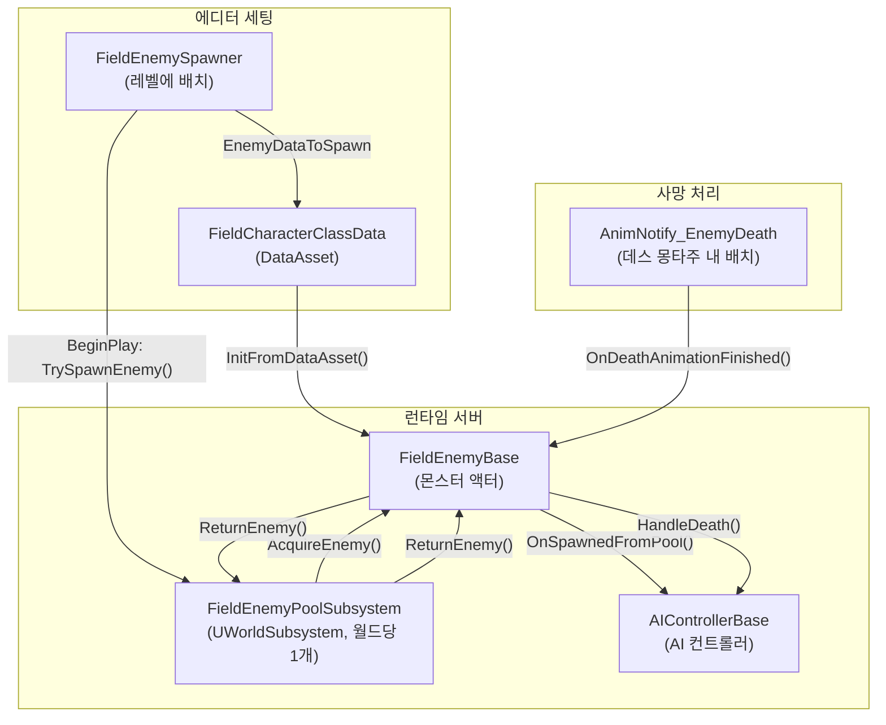
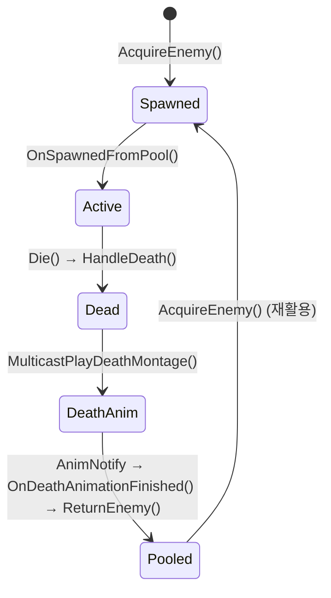

# 필드 몬스터 오브젝트 풀링 & DataAsset 스폰 시스템 — 워크스루

## 개요

필드 몬스터(`FieldEnemyBase`)를 **DataAsset 기반으로 관리**하고, **오브젝트 풀링**을 통해 오픈월드 환경에서 최적화된 스폰/리스폰 시스템을 구축한 전체 작업 내역입니다.

---

## 시스템 아키텍처



---

## 변경/생성된 파일 목록

### 신규 생성

| 파일 | 역할 |
|------|------|
| [FieldEnemyPoolSubsystem.h](file:///c:/Users/KGA/Documents/Unreal%20Projects/ProjectDG/Source/ProjectDG/Public/System/FieldEnemyPoolSubsystem.h) | 오브젝트 풀 관리자 (UWorldSubsystem) 헤더 |
| [FieldEnemyPoolSubsystem.cpp](file:///c:/Users/KGA/Documents/Unreal%20Projects/ProjectDG/Source/ProjectDG/Private/System/FieldEnemyPoolSubsystem.cpp) | 풀 관리자 구현 (Acquire/Return) |
| [FieldEnemySpawner.h](file:///c:/Users/KGA/Documents/Unreal%20Projects/ProjectDG/Source/ProjectDG/Public/Character/Enemy/Field/Spawner/FieldEnemySpawner.h) | 레벨 배치용 스포너 액터 헤더 |
| [FieldEnemySpawner.cpp](file:///c:/Users/KGA/Documents/Unreal%20Projects/ProjectDG/Source/ProjectDG/Private/Character/Enemy/Field/Spawner/FieldEnemySpawner.cpp) | 스포너 구현 (플레이어 수 기반 스폰, 리스폰 타이머) |
| [AnimNotify_EnemyDeath.h](file:///c:/Users/KGA/Documents/Unreal%20Projects/ProjectDG/Source/ProjectDG/Public/Character/Enemy/Animation/Notify/AnimNotify_EnemyDeath.h) | 데스 몽타주 완료 시 풀 반환 트리거 노티파이 |
| [AnimNotify_EnemyDeath.cpp](file:///c:/Users/KGA/Documents/Unreal%20Projects/ProjectDG/Source/ProjectDG/Private/Character/Enemy/Animation/Notify/AnimNotify_EnemyDeath.cpp) | 노티파이 구현 |

### 수정

| 파일 | 주요 변경 내용 |
|------|---------------|
| [FieldCharacterClassData.h](file:///c:/Users/KGA/Documents/Unreal%20Projects/ProjectDG/Source/ProjectDG/Public/Character/Enemy/Field/Data/FieldCharacterClassData.h) | `EnemyClass`, `BehaviorTree`, 스탯, 보상, GAS 이펙트 배열 추가 |
| [FieldEnemyBase.h](file:///c:/Users/KGA/Documents/Unreal%20Projects/ProjectDG/Source/ProjectDG/Public/Character/Enemy/Field/FieldEnemyBase.h) | 풀링 라이프사이클 함수 + Multicast RPC 추가 |
| [FieldEnemyBase.cpp](file:///c:/Users/KGA/Documents/Unreal%20Projects/ProjectDG/Source/ProjectDG/Private/Character/Enemy/Field/FieldEnemyBase.cpp) | 풀링 상태 초기화/복구 전체 구현 |
| [EnemyCharacterBase.cpp](file:///c:/Users/KGA/Documents/Unreal%20Projects/ProjectDG/Source/ProjectDG/Private/Character/Enemy/EnemyCharacterBase.cpp) | 사망 시 Pawn 충돌 Ignore 처리 추가 |
| [AIControllerBase.h](file:///c:/Users/KGA/Documents/Unreal%20Projects/ProjectDG/Source/ProjectDG/Public/AI/Controller/AIControllerBase.h) | `RestartAIFromPool()` 함수 추가 |
| [AIControllerBase.cpp](file:///c:/Users/KGA/Documents/Unreal%20Projects/ProjectDG/Source/ProjectDG/Private/AI/Controller/AIControllerBase.cpp) | AI 감각/플래그 복구 구현 |

---

## 각 컴포넌트 상세 설명

### 1. FieldCharacterClassData (DataAsset)

몬스터의 "설계도" 역할. 에디터에서 수치만 조정하면 코드 수정 없이 몬스터 변형을 만들 수 있습니다.

| 프로퍼티 | 용도 |
|----------|------|
| `EnemyClass` | 스폰할 블루프린트 클래스 (예: `BP_Goblin`) |
| `BehaviorTree` | AI 비헤이비어 트리 (공유 BT 지원) |
| `EnemyLevel` | 몬스터 레벨 |
| `PatrolRadius` / `LeashDistance` | 순찰 반경 / 추격 한계 거리 |
| `RewardExp` / `MinRewardGold` / `MaxRewardGold` | 사망 보상 |
| `FieldTag` | 필드 식별용 GameplayTag |
| `StartupEffects` | 기본 AttributeSet(HP, 공격력 등) 초기화 GE |
| `EnemyStartupEffects` | 적 전용 AttributeSet(그로기 등) 초기화 GE |
| `ReturningEffectClass` | 귀환(리싱) 시 무적+리젠 GE |

---

### 2. FieldEnemyPoolSubsystem (UWorldSubsystem)

월드당 **단 1개만** 자동 생성되는 글로벌 오브젝트 풀 관리자입니다.

- **`AcquireEnemy(Class, Location, Rotation)`**: 풀에 비활성 몬스터가 있으면 꺼내고(`OnSpawnedFromPool`), 없으면 새로 `SpawnActor` 후 반환
- **`ReturnEnemy(Enemy)`**: 몬스터를 풀에 넣고 비활성화(`OnReturnedToPool`)
- 내부 저장소: `TMap<TSubclassOf<AFieldEnemyBase>, FFieldEnemyPoolArray>` — 클래스별로 풀을 분리 관리
- 스포너가 10개든 100개든 **같은 클래스의 몬스터는 하나의 풀을 공유**

---

### 3. FieldEnemySpawner (레벨 배치 액터)

레벨에 드래그&드롭으로 배치하는 스포너 액터입니다.

| 프로퍼티 | 기본값 | 설명 |
|----------|--------|------|
| `EnemyDataToSpawn` | — | 스폰할 DataAsset 지정 |
| `BaseSpawnCount` | 3 | 기본 유지 몬스터 수 |
| `ExtraSpawnPerPlayer` | 2 | 플레이어 1명 추가 시 추가 스폰 수 |
| `SpawnRadius` | 1500 | 스폰 반경 |
| `RespawnTime` | 10초 | 리스폰 주기 |
| `MinSpawnDistanceFromPlayer` | 800 | 플레이어 근접 스폰 방지 거리 |

**스폰 수 공식**: `BaseSpawnCount + (NumPlayers - 1) × ExtraSpawnPerPlayer`

**리스폰 로직**: `HandleRespawnTimer`가 주기적으로 활성 몬스터 수를 체크하여 목표보다 부족하면 자동으로 `TrySpawnEnemy()` 호출

---

### 4. 몬스터 라이프사이클 (풀링 상태 흐름)



---

### 5. OnSpawnedFromPool() — 풀에서 꺼낼 때 복구하는 항목들

풀링의 핵심은 **"죽어서 망가진 시체를 완벽히 새것처럼 되돌리는 것"** 입니다.

| 순서 | 복구 항목 | 코드 위치 |
|------|----------|-----------|
| 1 | `bIsDead = false` + `State.Enemy.Dead` 태그 제거 | [FieldEnemyBase.cpp:258-260](file:///c:/Users/KGA/Documents/Unreal%20Projects/ProjectDG/Source/ProjectDG/Private/Character/Enemy/Field/FieldEnemyBase.cpp#L258-L260) |
| 2 | Health를 MaxHealth로 수동 복구 | [FieldEnemyBase.cpp:263-264](file:///c:/Users/KGA/Documents/Unreal%20Projects/ProjectDG/Source/ProjectDG/Private/Character/Enemy/Field/FieldEnemyBase.cpp#L263-L264) |
| 3 | 데스 몽타주 강제 정지 (`StopAllMontages`) | [FieldEnemyBase.cpp:268-273](file:///c:/Users/KGA/Documents/Unreal%20Projects/ProjectDG/Source/ProjectDG/Private/Character/Enemy/Field/FieldEnemyBase.cpp#L268-L273) |
| 4 | 위치 보정 (캡슐 HalfHeight만큼 Z축 올림) | [FieldEnemyBase.cpp:274-278](file:///c:/Users/KGA/Documents/Unreal%20Projects/ProjectDG/Source/ProjectDG/Private/Character/Enemy/Field/FieldEnemyBase.cpp#L274-L278) |
| 5 | **Multicast** — 충돌 복구, 가시성 복구, 이동모드 복구 | [FieldEnemyBase.cpp:344-368](file:///c:/Users/KGA/Documents/Unreal%20Projects/ProjectDG/Source/ProjectDG/Private/Character/Enemy/Field/FieldEnemyBase.cpp#L344-L368) |
| 6 | AI 컨트롤러 재시작 (`RestartAIFromPool`) | [AIControllerBase.cpp:97-106](file:///c:/Users/KGA/Documents/Unreal%20Projects/ProjectDG/Source/ProjectDG/Private/AI/Controller/AIControllerBase.cpp#L97-L106) |
| 7 | BrainComponent RestartLogic + BT 실행 | [FieldEnemyBase.cpp:288-298](file:///c:/Users/KGA/Documents/Unreal%20Projects/ProjectDG/Source/ProjectDG/Private/Character/Enemy/Field/FieldEnemyBase.cpp#L288-L298) |

> [!IMPORTANT]
> `ApplyDefaultEffects()`는 재스폰 시 **호출하지 않습니다.** Instant GE가 매번 중첩되어 스탯이 무한히 상승하는 버그를 방지하기 위함입니다. 스탯은 유지되고 체력만 수동 리셋합니다.

---

### 6. OnReturnedToPool() — 풀로 반환할 때 정리하는 항목들

| 순서 | 정리 항목 | 설명 |
|------|----------|------|
| 1 | **Multicast** — Hidden + Collision Off + Tick Off | 서버+클라이언트 모두에서 시체를 보이지 않게 처리 |
| 2 | AI BrainComponent StopLogic | AI 로직 정지 |
| 3 | GameplayCue 전부 제거 | 시각 이펙트 정리 |
| 4 | 모든 활성 GameplayEffect 제거 | 버프/디버프 찌꺼기 방지 |

---

### 7. 사망 시 충돌 처리

[EnemyCharacterBase.cpp:120-137](file:///c:/Users/KGA/Documents/Unreal%20Projects/ProjectDG/Source/ProjectDG/Private/Character/Enemy/EnemyCharacterBase.cpp#L120-L137)에서 데스 몽타주 시작과 동시에:

- 캡슐과 메시의 **Pawn 채널 충돌을 Ignore**로 변경
- 플레이어가 시체를 자연스럽게 통과할 수 있게 됨
- 풀에서 다시 꺼낼 때 `Multicast_OnSpawnedFromPool`에서 **Block으로 복구**

---

### 8. 월드 파티션 호환성

[FieldEnemyBase.cpp:29](file:///c:/Users/KGA/Documents/Unreal%20Projects/ProjectDG/Source/ProjectDG/Private/Character/Enemy/Field/FieldEnemyBase.cpp#L29)에서:

```cpp
bIsSpatiallyLoaded = false;
```

풀링 액터가 월드 파티션 그리드 셀 로딩/언로딩에 의해 영향받지 않도록 설정. 이를 통해 PIE 모드에서 `ensure(EditorHash)` 에러를 방지합니다.

---

## 해결한 버그 목록

| # | 증상 | 원인 | 해결 |
|---|------|------|------|
| 1 | 데스 몽타주 중 플레이어가 시체에 걸림 | 사망 후에도 Pawn 충돌이 Block 상태 | `MulticastPlayDeathMontage`에서 Pawn → Ignore |
| 2 | PIE에서 `ensure(EditorHash)` 에러 | 월드 파티션이 풀링 액터의 Bounds 변화를 추적 | `bIsSpatiallyLoaded = false` |
| 3 | `Team.Enemy` 태그 중첩 (x9, x10...) | 매 스폰마다 태그를 무조건 추가 | `HasMatchingGameplayTag()` 체크 후 추가 |
| 4 | 리스폰 즉시 다시 사망 루프 | `bIsDead`와 `State.Enemy.Dead` 태그 미초기화 | `OnSpawnedFromPool`에서 명시적 초기화 |
| 5 | 스탯이 리스폰마다 상승 | `ApplyDefaultEffects()`의 Instant GE 중첩 | 재스폰 시 호출 제거, Health만 수동 리셋 |
| 6 | 리스폰 시 땅에 박힘 | 스폰 좌표가 내비 바닥 기준이라 캡슐 중심이 매몰 | Z축에 `CapsuleHalfHeight` 보정 |
| 7 | 리스폰 후 움직이지 않음 | `DisableMovement()` 복구 누락 | `SetMovementMode(MOVE_Walking)` |
| 8 | 리스폰 후 피격 무반응 | 캡슐/메시 `NoCollision` 복구 누락 | `SetCollisionEnabled(QueryAndPhysics)` |
| 9 | 리스폰 후 AI 멍때림 | `bAIStoppedByDeath`, Perception 비활성 상태 미복구 | `RestartAIFromPool()` 추가 |
| 10 | 데스 자세로 기어다님 (간헐적) | 서버에서만 몽타주 정지/충돌 복구 → 클라이언트 미동기화 | `Multicast_OnSpawnedFromPool` / `Multicast_OnReturnedToPool` RPC 도입 |

---

## 에디터 세팅 가이드 (요약)

### Step 1: DataAsset 생성
콘텐츠 브라우저 → 우클릭 → Miscellaneous → Data Asset → **`FieldCharacterClassData`** 선택 → 스탯/BT/클래스 입력

### Step 2: 데스 몽타주에 AnimNotify 배치
Death Montage 열기 → 시체가 완전히 멈추는 프레임에 → **`AnimNotify_EnemyDeath`** 배치

### Step 3: 스포너 레벨 배치
Place Actors → **`FieldEnemySpawner`** 를 맵에 배치 → Details에서 DataAsset, 스폰 수, 반경, 리스폰 시간 설정

> [!TIP]
> 스포너를 100개 설치해도 풀링 매니저(SubSystem)는 월드에 1개만 존재하며, 같은 몬스터 클래스는 풀을 공유합니다.
